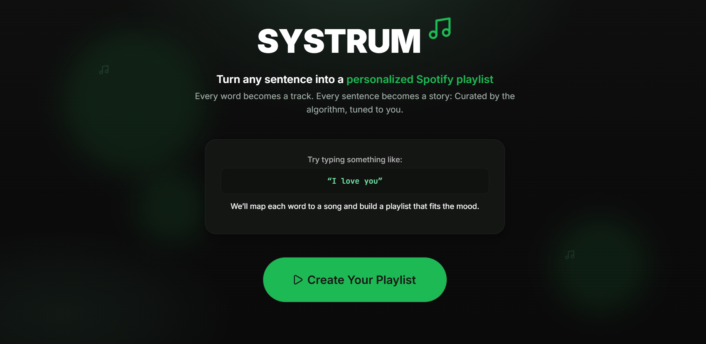

<div align="center">

</div>

<!-- <h1 align="center">Systrum</h1> -->
---

<div align="center">


</div>

---  

### What is Systrum?

A new interactive way to create spotify playlists!  
Just put in a sentence that you want to represent and our application will map out each word to a song for you to listen to on a new playlist!  
Discover new songs by inputting creative outlandish sentences, or create a message to send out to your friends!

<div align="center">
    
</div>

This was inspired by the twitter trend of indirect messages through your playlists! Our team decided to automate this process and allow for a new way to discover songs! Keep an eye on the repo for a link to our deployed site!

## Features

- Automation of sentences to playlists to spell out a message through your songs

- Spotify user authentication to send playlist to user's account

- Reactive frontend

## How to Use

Get a set of credentials from Spotify Developers API at https://developer.spotify.com/documentation/web-api?r_done=1  
You can put the client_id and client_secret into a .env file and insert that into your backend folder.  
You can now run the program using these 

```
docker compose up --build
```

## Contributors

[](https://github.com/edmuri)
[](https://github.com/cl-py)
[](https://github.com/basiltiongson0)


